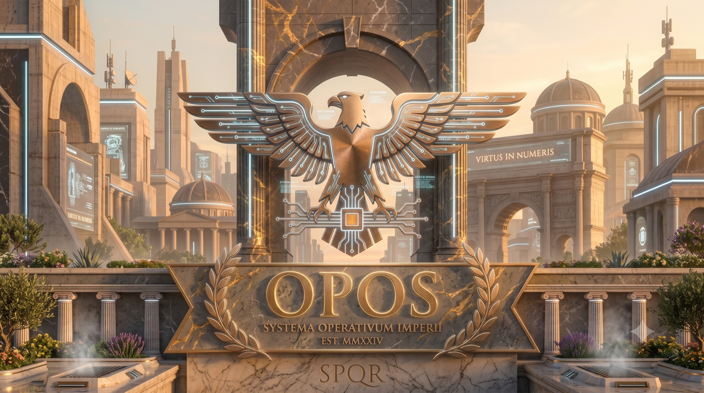

# OPOS

### Run a whole company as one person.

**OPOS is an AI-native operating system for your company — a plain GitHub repo where your mission, your departments, your roles, and your work all live as readable files, run by AI agents.**

In one paragraph: OPOS is an AI-native company operating system distributed as a free [Copier](https://copier.readthedocs.io/) template — a GitHub repository of markdown and JSON files that encodes a company's mission, policies, departments, agent roles, and work-in-flight backlogs. It runs on [Claude Code](https://claude.com/claude-code)'s native primitives — agents, skills, and folder conventions — with no runtime and no orchestration code. One founder, a git repo, AI agents doing the work, and human oversight through pull requests: every change lands as a reviewable git commit before it counts.

> **Why now:** AI agents have made the org chart software. The work a department used to do can now be described, delegated, and executed by an agent. OPOS is the bet that the next great company is one founder, a git repo, and an organization that runs itself.


---



---

## The big idea

A company is really just a set of decisions, roles, and repeatable work. OPOS encodes all of it as markdown in a single repository: who you are, what you're building, how the work gets done. There's no platform to log into and no runtime to operate — your company *is* the repo. You lead in plain language; an AI organization turns your intent into execution.

Because it's all files in git, your company is auditable, forkable, versioned, and entirely yours. Nothing is locked inside someone else's SaaS.

## The shift

For most of history, ambition was capped by headcount. To do more, you hired more — and hiring is slow, expensive, and hard to undo. OPOS removes that ceiling. When the org chart is software, a single person can hold the leverage of an entire company: a strategy function, a finance function, an engineering function, all staffed by agents that draft, analyze, and execute while you decide what matters.

This is what the "one-person company" actually looks like in practice — not a founder doing everything, but a founder *directing* everything.

## How it feels

You open your repo and talk to your company in ordinary language:

> **You:** Let's ship the new pricing page this week.
>
> **OPOS:** Spinning that up — opening a tracked task, drafting the plan, pulling in engineering. I'll check in before anything ships.

> **You:** Should we expand into the EU next quarter?
>
> **OPOS:** That's a strategic call — let me run it past the relevant leads, weigh the tradeoffs, and bring you a recommendation to approve or reject.

You state the goal. The organization decomposes it, does the work, and comes back when it needs your judgment.

## What makes it different

- **Your company is markdown, not a platform.** No runtime, no lock-in. Open the repo, read everything, own everything.
- **An organization that grows itself.** The org chart isn't hardcoded. As needs emerge, OPOS can design new roles, new departments, and new processes — so it keeps pace with your company instead of going stale.
- **AI-first by principle.** New capabilities default to AI. Humans are brought in deliberately — where lived experience, legal accountability, or physical presence genuinely require a person.
- **Autonomy with a human in the loop.** Routine work can run on its own schedule, but the decisions that count — shipping, spending, going public, hiring — always come back to you.
- **Everything in git.** Every decision, every change, every piece of work is tracked, reviewable, and reversible.

This isn't an agent framework for engineers to wire together pipelines. It's an operating system for *running a company* — built for founders, not just builders.

Unlike Python orchestration frameworks — [CrewAI](https://github.com/crewAIInc/crewAI) (57.7k GitHub stars as of August 2026), [MetaGPT](https://github.com/FoundationAgents/MetaGPT) (70.1k stars), and Microsoft's [AutoGen](https://github.com/microsoft/autogen) (60.7k stars, now in maintenance mode) — OPOS ships zero orchestration code. The company itself is the artifact: readable markdown files, versioned in git, executed by Claude Code's native agent and skill primitives. And unlike hosted no-code agent platforms such as [Lindy](https://www.lindy.ai/) (1,000+ integrations, plans from $29.99 per user per month) or Claude Code swarm harnesses like [claude-flow, now Ruflo](https://github.com/ruvnet/claude-flow) (69.5k stars), OPOS is a free, forkable template where every agent, policy, and decision lives as an auditable file.

As [LangChain's June 2026 framework review](https://www.langchain.com/resources/ai-agent-frameworks) puts it, "The best agent frameworks give developers clear primitives for tool calling, state management, and inter-agent communication without hiding what's happening underneath." OPOS applies that principle organizationally: Claude Code supplies the primitives, and OPOS supplies the company-shaped conventions layered on top.

## Where it's headed

OPOS is early and moving fast. Today it gives a single founder a credible, self-organizing company in a repo; the trajectory is a platform that covers ever more of what a real organization does — more of the company describable in files, more of the work the organization can carry on its own. The surface area keeps growing. This README stays deliberately high-level because the capabilities won't stop expanding.

## Get started

OPOS is distributed as a template you scaffold in one command, then bring to life in conversation:

```bash
copier copy gh:Koroqe/OPOS my-company-os -d COMPANY_NAME="My Company"
```

Open the new repo in your editor, start a Claude Code session, and **talk to your company** — it'll walk you through setting up your mission, departments, and first goals.

## FAQ

### How can a solo founder run an entire company with AI agents?

In OPOS, the entire organization — mission, policies, departments, roles, and backlogs — exists as markdown files in a GitHub repository, executed by Claude Code agents under human oversight. The founder directs work through a chief-of-staff agent; departments such as R&D, Finance, Legal, and Commercial each have a lead agent with a charter. The framing: not a founder doing everything, but a founder *directing* everything.

### How is OPOS different from CrewAI, MetaGPT, or AutoGen?

[CrewAI](https://github.com/crewAIInc/crewAI) (57.7k GitHub stars), [MetaGPT](https://github.com/FoundationAgents/MetaGPT) (70.1k stars), and [AutoGen](https://github.com/microsoft/autogen) (60.7k stars, now in maintenance mode) are Python frameworks: you write orchestration code. OPOS ships zero code — departments, roles, and processes are markdown files executed directly by Claude Code, so a non-engineer can read and change the whole company definition. Full breakdown: [OPOS vs CrewAI vs AutoGen vs Lindy](docs/opos-vs-crewai-autogen-lindy.md).

### How is OPOS different from Lindy or claude-flow?

[Lindy](https://www.lindy.ai/) is a hosted no-code platform with 1,000+ integrations from $29.99 per user per month — convenient, but your automations live in its cloud. [claude-flow, now Ruflo](https://github.com/ruvnet/claude-flow) (69.5k stars), is a swarm meta-harness for Claude Code. OPOS is neither: a free, forkable Copier template where the company itself — org chart, policies, decisions — is a version-controlled git repository you own.

### How do I scaffold a new OPOS company instance?

Install Python 3.10+, Copier 9.0.0+ (`pip install copier`), git, and the authenticated `gh` CLI, then run the `copier copy` command from [Get started](#get-started) above, followed by `git init`, an initial commit, and `gh repo create --private --push`. CORE files (agents, skills, templates) arrive pre-installed; STARTER files are yours to customize and are never overwritten by `copier update`.

### What do I do right after scaffolding?

Run the `/company-setup` skill in a Claude Code session at the repo root. It fills the six content-blank areas — Mission, Values, strategic priorities, the six default department missions (rnd, finance, people, legal, commercial, pr), and policies — in about ten questions and fifteen minutes, writing progress to files as you go. Then browse the populated OS via `/serve-console` at `http://127.0.0.1:8765/`.

### Can OPOS run multiple workstreams in parallel?

Yes — parallel sessions are first-class. Each terminal's chief-of-staff steward registers its own GitHub issue via `task-register`, the `.current-task` file lists every active issue number, and `task-update`/`task-complete` auto-pick with one active task or require `--issue` with several. `task-pause` and `task-resume` work per-issue.

### What can OPOS agents do without human approval?

The chief-of-staff steward follows a graduated permission ladder — auto (reads, tests, drafts), notice, confirm (e.g. `git commit`, closing issues, creating agents), explicit approval (e.g. `git push`, release cuts), and hard refuse for destructive operations. Shipping, spending, and strategic pivots always come back to you. The full ladder is documented in the chief-of-staff agent charter inside the repo. More questions: the [full OPOS FAQ](docs/faq.md).

## Learn more

- **Founder's guide** — the full, hands-on walkthrough of running your OPOS company ships inside every scaffold as its `README.md` (source: [`README.md.jinja`](README.md.jinja)).
- **Known limitations & roadmap** — [`RISKS.md`](RISKS.md.jinja) lays out, honestly, what's solid today and what's still ahead.
- **[OPOS vs CrewAI vs AutoGen vs Lindy](docs/opos-vs-crewai-autogen-lindy.md)** — where a git-based company OS sits among agent frameworks and no-code AI employees.
- **[OPOS FAQ](docs/faq.md)** — running a one-person company with AI agents, departments as markdown, and oversight via pull requests.
- **[How to run a company as one person with AI agents](docs/run-a-company-as-one-person.md)** — six approaches compared, from no-code AI employees to company-as-code.
- **[MetaGPT vs CrewAI](docs/metagpt-vs-crewai.md)** — simulation vs orchestration for AI agent teams, and where company-as-code fits.
- **[Alternatives to MetaGPT in 2026](docs/alternatives-to-metagpt.md)** — CrewAI, AutoGen's successors, no-code platforms, and company-as-code operating systems.
- **[Top AI agent frameworks for solo founders](docs/ai-agent-frameworks-for-solo-founders.md)** — six options across four categories, matched to how much code you want to write.

---

*Built on [Claude Code](https://claude.com/claude-code). Early-stage and evolving — feedback and forks welcome.*
